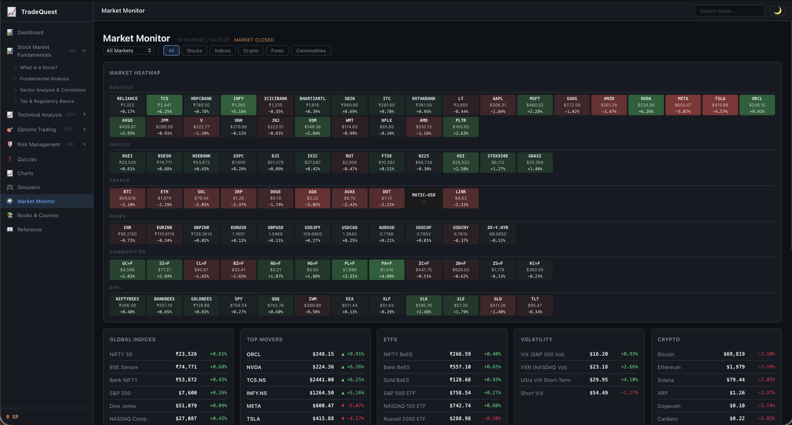
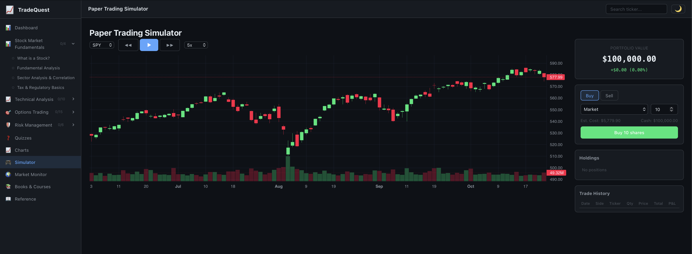
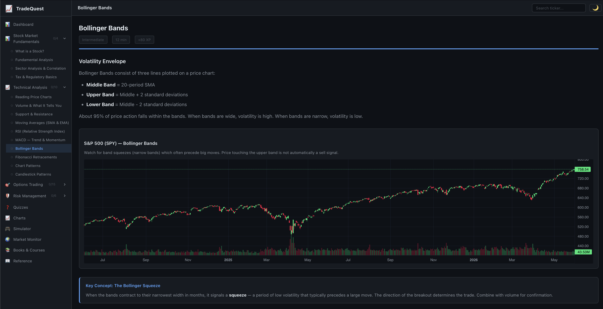
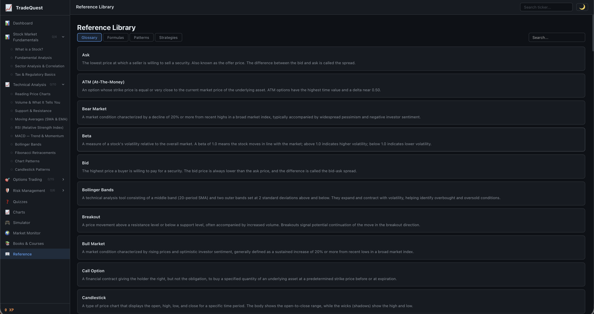
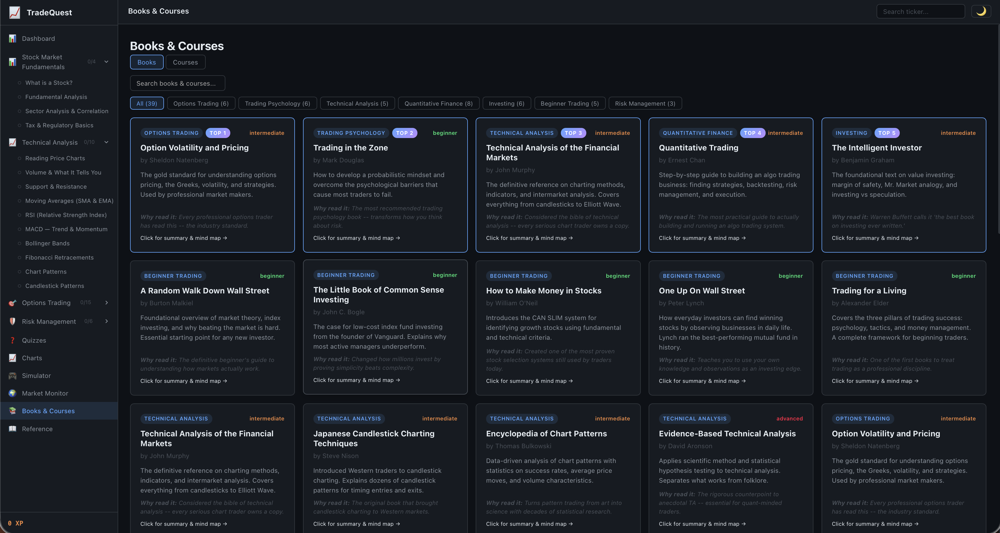
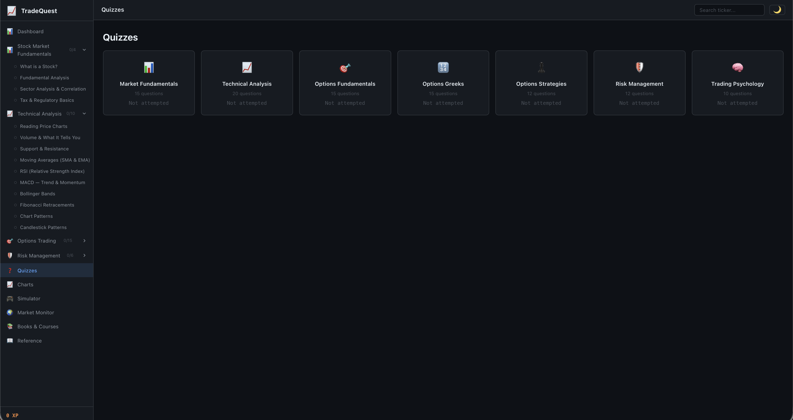

# TradeQuest

An interactive learning platform for stock and options trading — built as a native iOS app paired with a web companion. Teaches the fundamentals of price charts, technical indicators, options pricing, and risk management through interactive lessons, candlestick visualizations, quizzes, and a paper-trading simulator.

This repository contains two surfaces of the same product:

- **`swift-app/`** — Native iOS app written in Swift / SwiftUI (MVVM)
- **`web/`** — Vanilla HTML / CSS / JavaScript companion with an Express dev server

---

## What it does

- **Lessons** — Step-through chapters covering market basics, candlestick reading, volume, support/resistance, trend lines, moving averages, RSI, MACD, Bollinger Bands, VWAP, chart patterns, risk management, and options.
- **Interactive charts** — Candlestick / line / bar toggle, indicator overlays with adjustable parameters, draw-your-own trendlines, support/resistance highlighting.
- **Quizzes** — Built-in question bank with explanations, scored progress, and topic-tagged review.
- **Paper-trading simulator** — Virtual portfolio with live-style price feeds, P&L tracking, and order types (market, limit, stop).
- **Options module** — Black-Scholes pricing, payoff diagrams (calls, puts, spreads, straddles), and Greeks visualizations.
- **Reference & resources** — Curated reading lists, a glossary, and links to deeper reading.

---

## Screenshots

> All screenshots below are from the **web companion** (`web/`) running locally at `http://localhost:8080`.

### Market Monitor
A live, scannable view of indices, sector heatmap, ETFs, volatility, and crypto.


### Paper Trading Simulator
Buy/sell against historical OHLCV data with a fully simulated portfolio, playback controls, and trade history.


### Interactive Lessons
Each lesson pairs a written explanation with an interactive chart — here, Bollinger Bands plotted on the S&P 500 with a "key concept" call-out.


### Reference Library
A searchable trader's glossary with categories for terms, formulas, patterns, and strategies.


### Books & Courses
Curated books and courses tagged by track (options, technical analysis, trading psychology) and difficulty.


### Quizzes
Topic-tagged quiz hub covering market fundamentals, technical analysis, options, risk management, and trading psychology.


---

## `swift-app/` — iOS Application

Built with SwiftUI, async/await, and Combine. Uses Apple-native APIs end-to-end (no third-party UI libraries).

### Architecture

```
TradeQuest/
├── TradeQuestApp.swift          # App entry point
├── Models/                      # Data models (Lesson, Quiz, Portfolio, StockData, …)
├── ViewModels/                  # @MainActor view models per feature
├── Views/                       # SwiftUI views grouped by tab
├── Services/                    # Market data, content, portfolio, progress, backup
├── Utilities/                   # Theme, haptics, keychain backup helpers
├── Extensions/                  # Color theme, currency formatting, date helpers
├── Data/                        # Bundled JSON: lessons, quizzes, courses, summaries
└── Data/StockData/              # Bundled OHLCV history (AAPL, MSFT, TSLA, AMZN, INR=X)
```

### Build & Run

1. Open `swift-app/TradeQuest.xcodeproj` in Xcode 15 or later.
2. Set your development team and a unique bundle identifier in the project settings.
3. Select an iOS 16+ simulator or a real device.
4. `Cmd + R` to build and run.

### Live data

`Services/MarketService.swift` calls the public Yahoo Finance endpoints
(`query1.finance.yahoo.com/v8/finance/chart/...`) for live quotes and search.
No API keys required. The app falls back to bundled JSON when offline.

---

## `web/` — Web Companion

A no-build, no-framework single-page app. Pure HTML / CSS / vanilla JS with a small Express server for live-data proxying and refresh tasks.

### Stack

| Layer | Choice |
|-------|--------|
| Charts | TradingView **Lightweight Charts** (candlestick, line, volume) |
| Options payoff | **Plotly.js** |
| Server | **Express** (Node.js) |
| Data (offline) | Bundled JSON OHLCV files |
| Data (live) | Yahoo Finance public endpoints |
| Persistence | `localStorage` (progress, quiz scores, paper portfolio) |

### Architecture

The web app uses a **registry pattern** — every lesson and quiz file self-registers into global objects:

```js
// lessons/<topic>/<lesson-name>.js
LESSON_REGISTRY["what-is-a-stock"] = {
  id, title, track, sections, ...
};

// quizzes/<topic>.js
QUIZ_REGISTRY["fundamentals"] = {
  name, questions: [...]
};
```

`LESSON_MANIFEST` (in `js/registry.js`) controls track ordering and sequencing. Adding a new lesson is just dropping a `<script>` tag in `index.html` and adding the lesson id to the manifest — no build step.

### Project layout

```
web/
├── index.html            # Entry point + nav + script registration
├── server.js             # Express dev server
├── package.json
├── css/                  # Global styles + dark theme
├── js/
│   ├── app.js            # Router + state
│   ├── registry.js       # Lesson / quiz registries
│   ├── charts.js         # Chart helpers
│   ├── indicators.js     # SMA, EMA, RSI, MACD, Bollinger, VWAP
│   ├── quiz.js           # Quiz engine
│   ├── simulator.js      # Paper-trading engine
│   ├── live-data.js      # Yahoo Finance fetcher
│   ├── monitor.js        # Market monitor view
│   └── content-*.js      # Long-form content for each section
├── lessons/              # Self-registering lesson modules
├── quizzes/              # Self-registering quiz modules
├── data/                 # Bundled OHLCV JSON
├── scripts/              # Utility scripts (e.g. lesson-splitter)
└── vendor/               # Vendored third-party JS
```

### Run locally

```bash
cd web
npm install         # first time only
npm start           # Express server at http://localhost:8080
```

To re-fetch live OHLC data into `data/`:

```bash
npm run refresh-data
```

The site also works opened directly from `file://` (just open `index.html`) — but the live-data, ticker search, and Market Monitor features require the server.

### Server

`server.js` is intentionally tiny — it serves the static site and proxies live-data requests to avoid CORS issues. The only configurable knob is `PORT` (defaults to 8080):

```bash
PORT=3000 npm start
```

---

## Roadmap

- Account-level cloud sync between the iOS app and the web app
- Live brokerage paper-trading integration (read-only)
- Adaptive lesson sequencing based on quiz performance
- Watchlist alerts and indicator-based notifications

---

## License

MIT.
